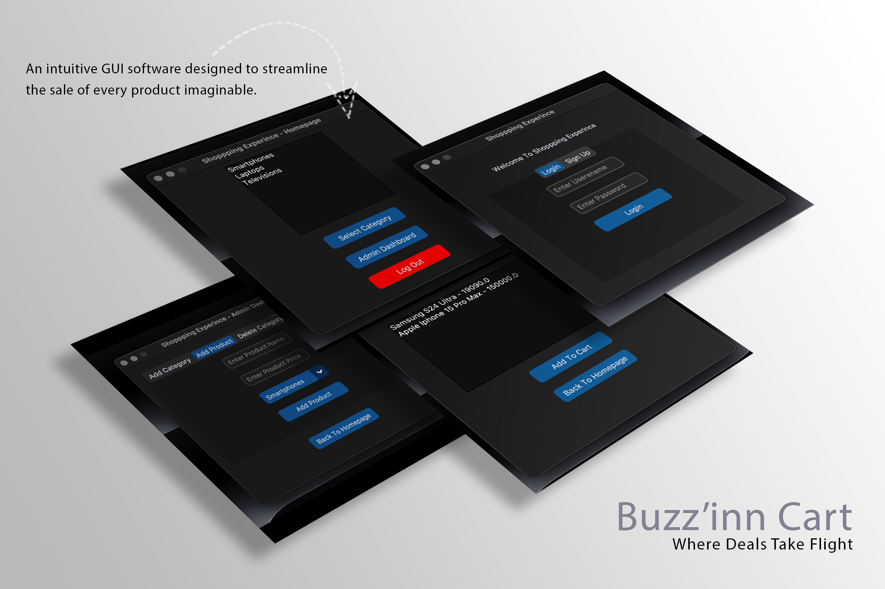
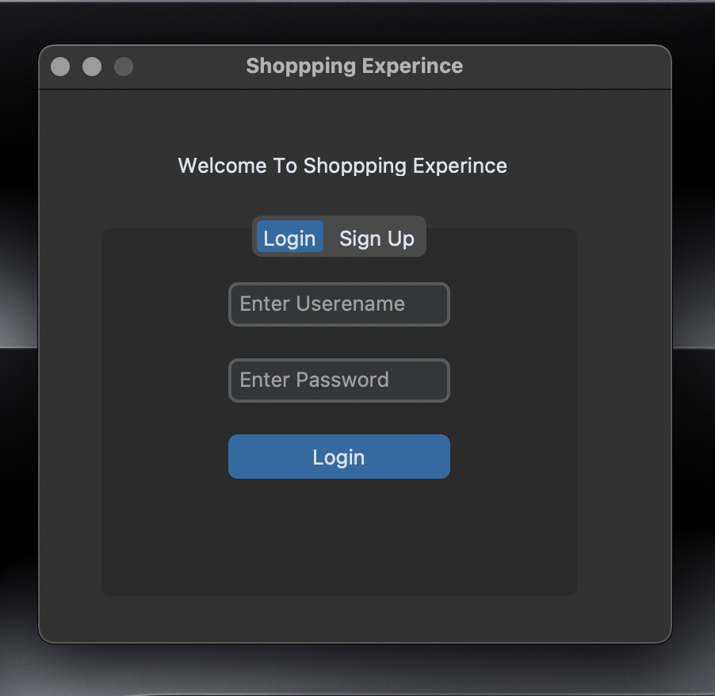
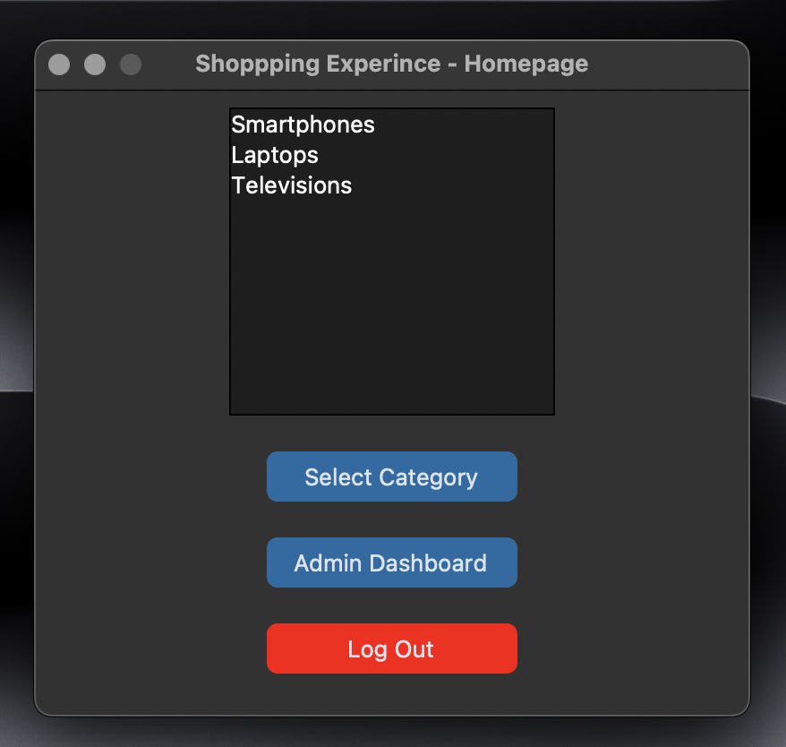

# Buzz'inn Cart

Welcome to **Buzz'inn Cart**! An intuitive and seamless shopping application built with Python, MongoDB, and Tkinter.

## Features

- **User Authentication**: Secure login and signup functionality.
- **Product Browsing**: Browse product categories and add items to your cart.
- **Cart Management**: Add products to your cart, clear the cart, and proceed to checkout.
- **Admin Dashboard**: Admin interface for adding products and categories.

## Installation

1. Clone the repository:
   ```bash
   git clone https://github.com/Jenil-Desai/Buzz-inn-cart.git
   ```
2. Navigate to the project directory:
   ```bash
   cd buzz-inn-cart
   ```
3. Install the required dependencies:
   ```bash
   pip install -r requirements.txt
   ```

## Usage

1. Run the application:
   ```bash
   python app.py
   ```
2. Follow the on-screen instructions to explore and use the application.

## Technologies Used

- **Python**: Core programming language
- **MongoDB**: Database for storing user and product data
- **Tkinter**: GUI library for creating the application interface
- **CustomTkinter**: Enhancing Tkinter with custom themes and widgets

## Screenshots


_Caption: An intuitive GUl software designed to streamline the sale of every product imaginable._


_Caption: Secure login and signup functionality._


_Caption: Browse product categories on the home page._

## Version Releases

To view the version releases, please visit our [Notion Version Releases Page](https://jenil-desai.notion.site/Version-Releases-Buzz-inn-Cart-5530b52cf85f48d9b198e4f39f361977?pvs=4).

## Contributing

We welcome contributions! Please follow these steps:

1. Fork the repository.
2. Create a new branch:
   ```bash
   git checkout -b feature/your-feature-name
   ```
3. Make your changes and commit them:
   ```bash
   git commit -m 'Add your feature'
   ```
4. Push to the branch:
   ```bash
   git push origin feature/your-feature-name
   ```
5. Open a pull request.

## License

This project is licensed under the MIT License - see the [LICENSE](LICENSE) file for details.

## Contact

For any inquiries or feedback, feel free to reach out at jenildev91@gmail.com.

---

_Buzz'inn Cart: Where Deals Take Flight_
